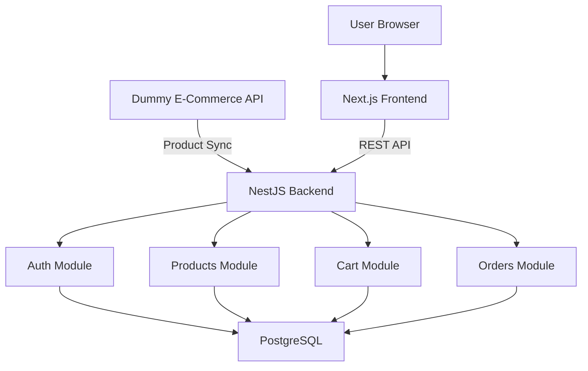

# NexStore - Premium E-Commerce Platform

NexStore is a modern, responsive, and robust e-commerce application built with Next.js, NestJS, and PostgreSQL.

## Architecture



## Technology Stack
- **Frontend**: Next.js (React), Tailwind CSS, Zustand, Axios, Lucide React
- **Backend**: NestJS, TypeORM, PostgreSQL, Passport JWT, class-validator
- **Database**: PostgreSQL (Docker)

## Project Structure
- `backend/`: NestJS backend containing all API routes and logic.
- `frontend/`: Next.js frontend application.
- `docker-compose.yml`: Database service configuration.

## Prerequisites
- Node.js (v18+)
- npm
- Docker and Docker Compose

## Setup Instructions

### 1. Database
```bash
docker compose up -d
```
This will start a PostgreSQL instance on port `5439` to avoid conflicts.

### 2. Backend Setup
```bash
cd backend
npm install
npm run migration:run
npm run products:sync
npm run start:dev
```
*Note: Wait for migrations and product synchronization to finish before starting the frontend.*

### 3. Frontend Setup
```bash
cd frontend
npm install
npm run dev
```
Open [http://localhost:3000](http://localhost:3000) to view the application.

## Known Demonstration Bug
> [!WARNING]
> The application intentionally contains a checkout property mismatch.
> - **Frontend** sends: `userName`
> - **Backend** expects: `user_name`
>
> The backend rejects the request with a 400 Bad Request because `user_name` is required. The frontend intentionally swallows the error, resulting in a silent failure that leaves the user unaware of the backend rejection. This is used for demonstration purposes.
